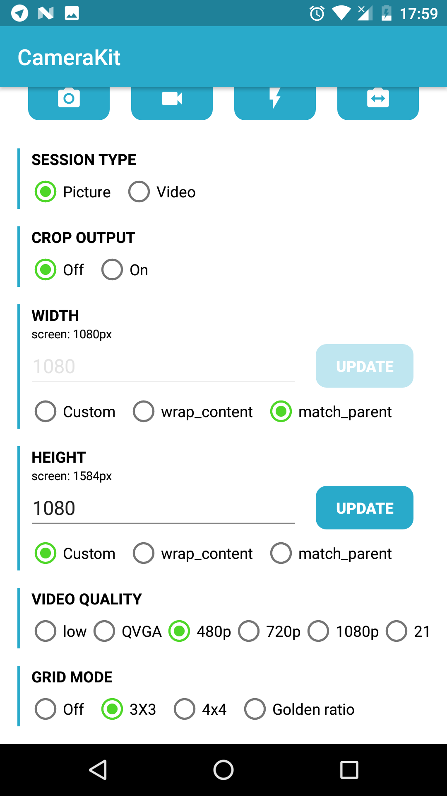

<p align="center">
  
</p>

# CameraView

CameraView is a well documented, high-level library that makes capturing pictures and videos easy, addressing most of the common issues and needs, and still leaving you with flexibility where needed.

```groovy
compile 'com.otaliastudios:cameraview:1.1.3'
```

<p>
  
  
</p>

*This was a fork of [CameraKit-Android library](https://github.com/gogopop/CameraKit-Android), originally a fork of [Google's CameraView library](https://github.com/google/cameraview), but has been completely rewritten. See [below](#roadmap) for a list of what was done. Feel free to contribute - this is under active development.*

### Features

- Seamless image and video capturing
- **Gestures** support (tap to focus, pinch to zoom and much more)
- System permission handling
- Dynamic sizing behavior
  - Create a `CameraView` of **any size**
  - Center inside or center crop behaviors
  - Automatic output cropping to match your `CameraView` bounds
- Built-in **grid drawing**
- Multiple capture methods
  - Take high-resolution pictures with `capturePicture`
  - Take quick snapshots as a freeze frame of the preview with `captureSnapshot` (similar to Snapchat and Instagram)
- Control flash, zoom, white balance, exposure correction and more
- **Metadata** support for pictures and videos
  - Automatically detected orientation tags
  - Plug in location tags with `setLocation()` API
- `CameraUtils` to help with Bitmaps and orientations
- Lightweight, no dependencies, just support `ExifInterface`
- Works down to API level 15

# Docs

- [Usage](#usage)
  - [Capturing Images](#capturing-images)
  - [Capturing Video](#capturing-video)
  - [Other camera events](#other-camera-events)
- [Gestures](#gestures)  
- [Dynamic Sizing Behavior](#dynamic-sizing-behavior)
  - [Center Inside](#center-inside)
  - [Center Crop](#center-crop)
- [Camera Controls](#camera-controls)
- [Other APIs](#other-apis)  
- [Permissions Behavior](#permissions-behavior)
- [Manifest file](#manifest-file)
- [Roadmap](#roadmap)

## Usage

To use the CameraView engine, simply add a `CameraView` to your layout:

```xml
<com.otaliastudios.cameraview.CameraView
    android:id="@+id/camera"
    android:keepScreenOn="true"
    android:layout_width="wrap_content"
    android:layout_height="wrap_content" />
```

Make sure you override `onResume`, `onPause` and  `onDestroy` in your activity, and call `CameraView.start()`, `stop()` and `destroy()`.

```java
@Override
protected void onResume() {
    super.onResume();
    cameraView.start();
}

@Override
protected void onPause() {
    super.onPause();
    cameraView.stop();
}

@Override
protected void onDestroy() {
    super.onDestroy();
    cameraView.destroy();
}
```

### Capturing Images

To capture an image just call `CameraView.capturePicture()`. Make sure you setup a `CameraListener` to handle the image callback.

```java
camera.addCameraListener(new CameraListener() {
    @Override
    public void onPictureTaken(byte[] picture) {
        // Create a bitmap or a file...
        // CameraUtils will read EXIF orientation for you, in a worker thread.
        CameraUtils.decodeBitmap(picture, ...);
    }
});

camera.capturePicture();
```

You can also use `camera.captureSnapshot()` to capture a preview frame. This is faster, though will ensure lower quality output.

### Capturing Video

To capture video just call `CameraView.startRecordingVideo(file)` to start, and `CameraView.stopRecordingVideo()` to finish. Make sure you setup a `CameraListener` to handle the video callback.

```java
camera.addCameraListener(new CameraListener() {
    @Override
    public void onVideoTaken(File video) {
        // The File is the same you passed before.
        // Now it holds a MP4 video.
    }
});

// Select output file. Make sure you have write permissions.
File file = ...;

// Record a 2500 ms video:
camera.startRecordingVideo(file, 2500);

// Full version
camera.startRecordingVideo(file);
camera.postDelayed(new Runnable() {
    @Override
    public void run() {
        // This will trigger onVideoTaken().
        camera.stopRecordingVideo();
    }
}, 2500);

```

### Other camera events

Make sure you can react to different camera events by setting up one or more `CameraListener` instances. All these are executed on the UI thread.

```java
camera.addCameraListener(new CameraListener() {

    /**
     * Notifies that the camera was opened.
     * The options object collects all supported options by the current camera.
     */
    @Override
    public void onCameraOpened(CameraOptions options) {}

    /**
     * Notifies that the camera session was closed.
     */
    @Override
    public void onCameraClosed() {}

    /**
     * Notifies that a picture previously captured with capturePicture()
     * or captureSnapshot() is ready to be shown or saved.
     *
     * If planning to get a bitmap, you can use CameraUtils.decodeBitmap()
     * to decode the byte array taking care about orientation.
     */
    @Override
    public void onPictureTaken(byte[] picture) {}

    /**
     * Notifies that a video capture has just ended. The file parameter is the one that
     * was passed to startCapturingVideo(File), or a fallback video file.
     */
    @Override
    public void onVideoTaken(File video) {}
    
    /**
     * Notifies that the device was tilted or the window offset changed.
     * The orientation passed can be used to align views (e.g. buttons) to the current
     * camera viewport so they will appear correctly oriented to the user.
     */
    @Override
    public void onOrientationChanged(int orientation) {}

    /**
     * Notifies that user interacted with the screen and started focus with a gesture,
     * and the autofocus is trying to focus around that area.
     * This can be used to draw things on screen.
     */    
    @Override
    public void onFocusStart(PointF point) {}
    
    /**
     * Notifies that a gesture focus event just ended, and the camera converged
     * to a new focus (and possibly exposure and white balance).
     */
    @Override
    public void onFocusEnd(boolean successful, PointF point) {}
    
    /**
     * Noitifies that a finger gesture just caused the camera zoom
     * to be changed. This can be used, for example, to draw a seek bar.
     */
    @Override
    public void onZoomChanged(float newValue, float[] bounds, PointF[] fingers) {}
    
    /**
     * Noitifies that a finger gesture just caused the camera exposure correction
     * to be changed. This can be used, for example, to draw a seek bar.
     */
    @Override 
    public void onExposureCorrectionChanged(float newValue, float[] bounds, PointF[] fingers) {}

});
```

## Gestures

`CameraView` listen to lots of different gestures inside its bounds. You have the chance to map these gestures to particular actions or camera controls, using `mapGesture()`. This lets you emulate typical behaviors in a single line:

```java
cameraView.mapGesture(Gesture.PINCH, GestureAction.ZOOM); // Pinch to zoom!
cameraView.mapGesture(Gesture.TAP, GestureAction.FOCUS_WITH_MARKER); // Tap to focus!
cameraView.mapGesture(Gesture.LONG_TAP, GestureAction.CAPTURE); // Long tap to shoot!
```

Simple as that. More gestures are coming. There are two things to be noted:

- Not every mapping is valid. For example, you can't control zoom with long taps, or start focusing by pinching.
- Some actions might not be supported by the sensor. Check out `CameraOptions` to know what's legit and what's not.

|Gesture (XML)|Description|Can be mapped to|
|-------------|-----------|----------------|
|`PINCH` (`cameraGesturePinch`)|Pinch gesture, typically assigned to the zoom control.|`zoom` `exposureCorrection` `none`|
|`TAP` (`cameraGestureTap`)|Single tap gesture, typically assigned to the focus control.|`focus` `focusWithMarker` `capture` `none`|
|`LONG_TAP` (`cameraGestureLongTap`)|Long tap gesture.|`focus` `focusWithMarker` `capture` `none`|
|`SCROLL_HORIZONTAL` (`cameraGestureScrollHorizontal`)|Horizontal movement gesture.|`zoom` `exposureCorrection` `none`|
|`SCROLL_VERTICAL` (`cameraGestureScrollVertical`)|Vertical movement gesture.|`zoom` `exposureCorrection` `none`|


## Dynamic Sizing Behavior

`CameraView` has a smart measuring behavior that will let you do what you want with a few flags. Measuring is controlled simply by `layout_width` and `layout_height` attributes, with this meaning:

- `WRAP_CONTENT` : try to stretch this dimension to respect the preview aspect ratio.
- `MATCH_PARENT` : fill this dimension, even if this means ignoring the aspect ratio.
- Fixed values (e.g. `500dp`) : respect this dimension.

You can have previews of all sizes, not just the supported presets. Whaterever you do, the preview will never be distorted. 

### Center inside

You can emulate a **center inside** behavior (like the `ImageView` scaletype) by setting both dimensions to `wrap_content`. The camera will get the biggest possible size that fits into your bounds, just like what happens with image views.


```xml
<com.otaliastudios.cameraview.CameraView
    android:layout_width="wrap_content"
    android:layout_height="wrap_content" />
```

This means that the whole preview is visible, and the image output matches what was visible during the capture.

### Center crop

You can emulate a **center crop** behavior by setting both dimensions to fixed values or to `MATCH_PARENT`. The camera view will fill the rect. If your dimensions don't match the aspect ratio of the internal preview surface, the surface will be cropped to fill the view, just like `android:scaleType="centerCrop"` on an `ImageView`.

```xml
<com.otaliastudios.cameraview.CameraView
    android:layout_width="match_parent"
    android:layout_height="match_parent" />
```

This means that part of the preview is hidden, and the image output will contain parts of the scene that were not visible during the capture. If this is a problem, see [cameraCropOutput](#cameracropoutput).

## Camera controls

Most camera parameters can be controlled through XML attributes or linked methods.

```xml
<com.otaliastudios.cameraview.CameraView
    android:id="@+id/camera"
    android:layout_width="match_parent"
    android:layout_height="wrap_content"
    android:keepScreenOn="true"
    app:cameraFacing="back"
    app:cameraFlash="off"
    app:cameraGrid="off"
    app:cameraSessionType="picture"
    app:cameraCropOutput="false"  
    app:cameraJpegQuality="100"
    app:cameraVideoQuality="480p"
    app:cameraWhiteBalance="auto" />
```

|XML Attribute|Method|Values|Default Value|
|-------------|------|------|-------------|
|[`cameraSessionType`](#camerasessiontype)|`setSessionType()`|`picture` `video`|`picture`|
|[`cameraFacing`](#camerafacing)|`setFacing()`|`back` `front`|`back`|
|[`cameraFlash`](#cameraflash)|`setFlash()`|`off` `on` `auto` `torch`|`off`|
|[`cameraGrid`](#cameragrid)|`setGrid()`|`off` `draw3x3` `draw4x4` `drawPhi`|`off`|
|[`cameraCropOutput`](#cameracropoutput)|`setCropOutput()`|`true` `false`|`false`|
|[`cameraJpegQuality`](#camerajpegquality)|`setJpegQuality()`|`0 <= n <= 100`|`100`|
|[`cameraVideoQuality`](#cameravideoquality)|`setVideoQuality()`|`lowest` `highest` `maxQvga` `max480p` `max720p` `max1080p` `max2160p`|`max480p`|
|[`cameraWhiteBalance`](#camerawhitebalance)|`setWhiteBalance()`|`auto` `incandescent` `fluorescent` `daylight` `cloudy`|`auto`|

#### cameraSessionType

What to capture - either picture or video. This has a couple of consequences:

- Sizing: capture and preview size are chosen among the available picture or video sizes, depending on the flag. When `picture`, we choose the max possible picture size and adapt the preview. When `video`, we respect the `videoQuality` choice and adapt the picture and the preview size.
- Picture capturing: due to sizing behavior, capturing pictures in `video` mode might lead to inconsistent results. In this case it is encouraged to use `captureSnapshot` instead, which will capture preview frames. This is fast and thus works well with slower camera sensors.
- Picture capturing: while recording a video, image capturing might work, but it is not guaranteed (it's device dependent)
- Permission behavior: when requesting a `video` session, the record audio permission will be requested. If this is needed, the audio permission should be added to your manifest or the app will crash.

```java
cameraView.setSessionType(SessionType.PICTURE);
cameraView.setSessionType(SessionType.VIDEO);
```

#### cameraFacing

Which camera to use, either back facing or front facing.

```java
cameraView.setFacing(Facing.BACK);
cameraView.setFacing(Facing.FRONT);
```

#### cameraFlash

Flash mode, either off, on, auto or *torch*.

```java
cameraView.setFlash(Flash.OFF);
cameraView.setFlash(Flash.ON);
cameraView.setFlash(Flash.AUTO);
cameraView.setFlash(Flash.TORCH);
```

#### cameraGrid

Lets you draw grids over the camera preview. Supported values are `off`, `draw3x3` and `draw4x4` for regular grids, and `drawPhi` for a grid based on the golden ratio constant, often used in photography.

```java
cameraView.setGrid(Grid.OFF);
cameraView.setGrid(Grid.DRAW_3X3);
cameraView.setGrid(Grid.DRAW_4X4);
cameraView.setGrid(Grid.DRAW_PHI);
```

#### cameraCropOutput

Whether the output picture should be cropped to fit the aspect ratio of the preview surface.
This can guarantee consistency between what the user sees and the final output, if you fixed the camera view dimensions. This does not support videos.

#### cameraJpegQuality

Sets the JPEG quality of pictures.

```java
cameraView.setJpegQuality(100);
cameraView.setJpegQuality(50);
```

#### cameraVideoQuality

Sets the desired video quality.

```java
cameraView.setVideoQuality(VideoQuality.LOWEST);
cameraView.setVideoQuality(VideoQuality.HIGHEST);
cameraView.setVideoQuality(VideoQuality.MAX_QVGA);
cameraView.setVideoQuality(VideoQuality.MAX_480P);
cameraView.setVideoQuality(VideoQuality.MAX_720P);
cameraView.setVideoQuality(VideoQuality.MAX_1080P);
cameraView.setVideoQuality(VideoQuality.MAX_2160P);
```

#### cameraWhiteBalance

Sets the desired white balance for the current session.

```java
cameraView.setWhiteBalance(WhiteBalance.AUTO);
cameraView.setWhiteBalance(WhiteBalance.INCANDESCENT);
cameraView.setWhiteBalance(WhiteBalance.FLUORESCENT);
cameraView.setWhiteBalance(WhiteBalance.DAYLIGHT);
cameraView.setWhiteBalance(WhiteBalance.CLOUDY);
```

## Other APIs

Other APIs not mentioned above are provided, and are well documented and commented in code.

|Method|Description|
|------|-----------|
|`isStarted()`|Returns true if `start()` was called succesfully. This does not mean that camera is open or showing preview.|
|`mapGesture(Gesture, GestureAction)`|Maps a certain gesture to a certain action. No-op if the action is not supported.|
|`clearGesture(Gesture)`|Clears any action mapped to the given gesture.|
|`getCameraOptions()`|If camera was started, returns non-null object with information about what is supported.|
|`getExtraProperties()`|If camera was started, returns non-null object with extra information about the camera sensor. Not very useful at the moment.|
|`setZoom(float)`, `getZoom()`|Sets a zoom value, where 0 means camera zoomed out and 1 means zoomed in. No-op if zoom is not supported, or camera not started.|
|`setExposureCorrection(float)`, `getExposureCorrection()`|Sets exposure compensation EV value, in camera stops. No-op if this is not supported. Should be between the bounds returned by CameraOptions.|
|`toggleFacing()`|Toggles the facing value between `Facing.FRONT` and `Facing.BACK`.|
|`toggleFlash()`|Toggles the flash value between `Flash.OFF`, `Flash.ON`, and `Flash.AUTO`.|
|`setLocation(double, double)`|Sets latitude and longitude to be appended to picture/video metadata.|
|`startAutoFocus(float, float)`|Starts an autofocus process at the given coordinates, with respect to the view dimensions.|
|`getPreviewSize()`|Returns the size of the preview surface. If CameraView was not constrained in its layout phase (e.g. it was `wrap_content`), this will return the same aspect ratio of CameraView.|
|`getSnapshotSize()`|Returns `getPreviewSize()`, since a snapshot is a preview frame.|
|`getPictureSize()`|Returns the size of the output picture. The aspect ratio is consistent with `getPreviewSize()`.|

Take also a look at public methods in `CameraUtils`, `CameraOptions`, `ExtraProperties`.

## Permissions behavior

`CameraView` needs two permissions:

- `android.permission.CAMERA` : required for capturing pictures and videos
- `android.permission.RECORD_AUDIO` : required for capturing videos

You can handle permissions yourself and then call `CameraView.start()` once they are acquired. If they are not, `CameraView` will request permissions to the user based on the `sessionType` that was set. In that case, you can restart the camera if you have a successful response from `onRequestPermissionResults()`.

## Manifest file

The library manifest file is not strict and only asks for camera permissions. This means that:

- If you wish to record videos, you should also add `android.permission.RECORD_AUDIO` to required permissions

```xml
<uses-permission android:name="android.permission.RECORD_AUDIO"/>
```

- If you want your app to be installed only on devices that have a camera, you should add:

```xml
<uses-feature
    android:name="android.hardware.camera"
    android:required="true"/>
```

If you don't request this feature, you can use `CameraUtils.hasCameras()` to detect if current device has cameras, and then start the camera view.

## Roadmap

This is what was done since the library was forked. I have kept the original structure, but practically all the code was changed.

- *a huge number of serious bugs fixed*
- *decent orientation support for both pictures and videos*
- *EXIF support*
- *real tap-to-focus support*
- *pinch-to-zoom support*
- *simpler APIs, docs and heavily commented code*
- *new `captureSnapshot` API*
- *new `setLocation` and `setWhiteBalance` APIs*
- *new `setGrid` APIs, to draw 3x3, 4x4 or golden ratio grids*
- *option to pass a `File` when recording a video*
- *other minor API additions*
- *replacing Method and Permissions stuff with simpler `sessionType`* 
- *smart measuring and sizing behavior, replacing bugged `adjustViewBounds`*
- *measure `CameraView` as center crop or center inside*
- *add multiple `CameraListener`s for events*
- *gesture framework support*
- *scroll gestures support*
- *MediaActionSound support*

These are still things that need to be done, off the top of my head:

- [x] fix CropOutput class presumably not working on rotated pictures
- [x] test video and 'frame' capture behavior, I expect some bugs there
- [x] simple APIs to draw grid lines
- [x] check focus, not sure it exposes the right part of the image
- [x] replace setCameraListener() with addCameraListener()
- [x] better threading, for example ensure callbacks are called in the ui thread
- [x] pinch to zoom support
- [x] exposure correction APIs
- [x] change demo app icon
- [x] refactor package name
- [x] new Gestures framework to map gestures to camera controls
- [x] heavily reduced dependencies
- [ ] `Camera2` integration
- [x] publish to bintray
- [ ] check onPause / onStop / onSaveInstanceState consistency
- [ ] add a `setPreferredAspectRatio` API to choose the capture size. Preview size will adapt, and then, if let free, the CameraView will adapt as well
- [ ] animate grid lines similar to stock camera app
- [ ] add onRequestPermissionResults for easy permission callback
- [ ] better error handling, maybe with a onError(e) method in the public listener, or have each public method return a boolean

