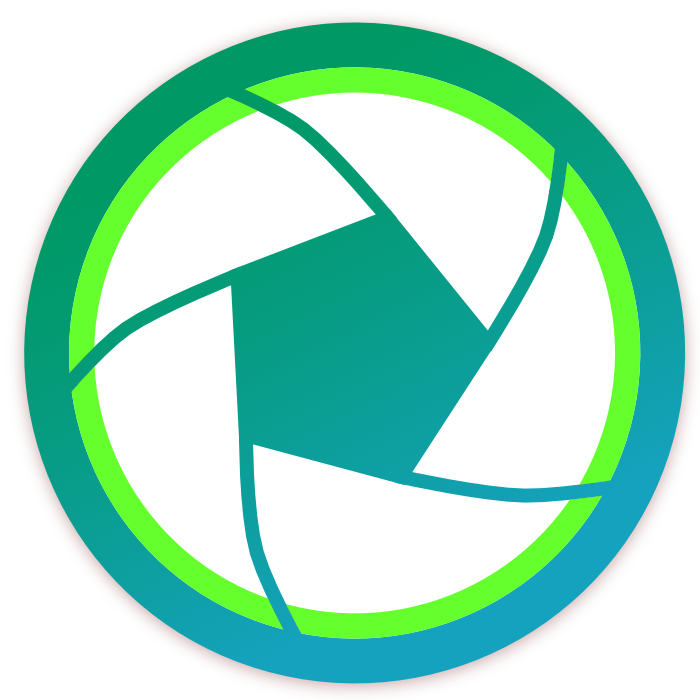
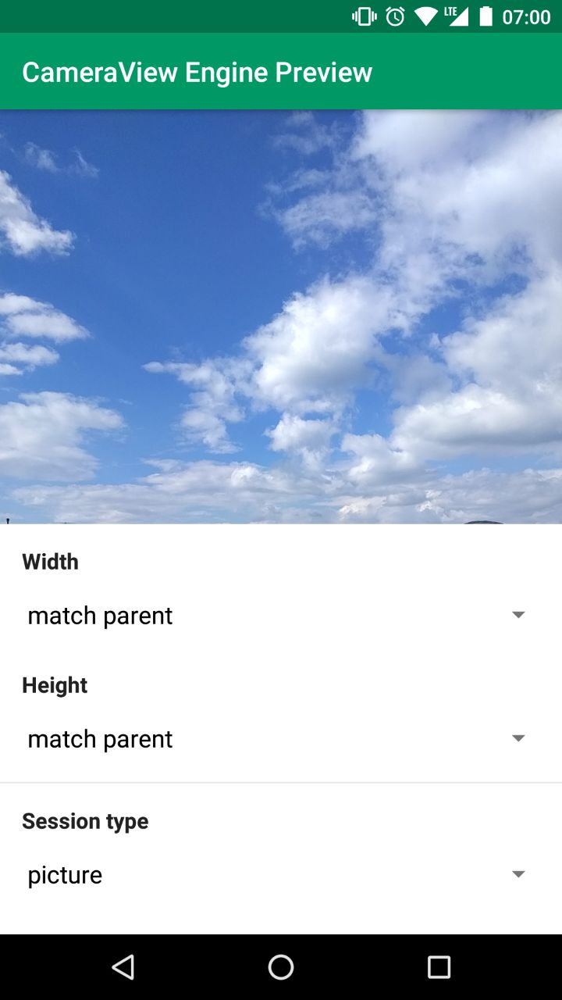

[](https://travis-ci.org/natario1/CameraView)
[](https://codecov.io/gh/natario1/CameraView)

<p align="center">
  
</p>

# CameraView

CameraView is a well documented, high-level library that makes capturing pictures and videos easy,
addressing most of the common issues and needs, and still leaving you with flexibility where needed.
See [CHANGELOG](https://github.com/natario1/CameraView/blob/master/CHANGELOG.md).

```groovy
compile 'com.otaliastudios:cameraview:1.5.1'
```

Make sure your project repositories include the `jcenter()`:

```groovy
allprojects {
  repositories {
    jcenter()
  }
}
```


<p>
  
  
  
</p>

*This was a fork of [CameraKit-Android](https://github.com/gogopop/CameraKit-Android), originally a
fork of [Google's CameraView](https://github.com/google/cameraview), but has been
[completely rewritten](https://github.com/natario1/CameraView/graphs/contributors?type=d).
See below for a [list of what was done](#roadmap) and [licensing info](#contributing-and-licenses).*

### Features

- Seamless image and video capturing
- **Gestures** support (tap to focus, pinch to zoom and much more)
- System permission handling
- **Smart sizing** behavior
  - Preview: Create a `CameraView` of **any size**
  - Preview: Center inside or center crop behaviors
  - Output: Handy utilities to set the output size
  - Output: Automatic cropping to match your `CameraView` preview bounds
- Built-in **grid drawing**
- Multiple capture methods
  - Take high-resolution pictures with `capturePicture`
  - Take **quick snapshots** as a freeze frame of the preview with `captureSnapshot`
- Control HDR, flash, zoom, white balance, exposure correction and more
- **Frame processing** support
- **Metadata** support for pictures and videos
  - Automatically detected orientation tags
  - Plug in **location tags** with `setLocation()` API
- `CameraUtils` to help with Bitmaps and orientations
- Error handling
- Thread safe, **well tested**
- **Lightweight**, no dependencies, just support `ExifInterface`
- Works down to API level 15

# Docs

- [Usage](#usage)
  - [Capturing Images](#capturing-images)
  - [Capturing Video](#capturing-video)
  - [Other camera events](#other-camera-events)
- [Gestures](#gestures)  
- [Sizing Behavior](#sizing-behavior)
  - [Preview Size](#preview-size)
  - [Picture Size](#picture-size)
- [Camera Controls](#camera-controls)
- [Frame Processing](#frame-processing)
- [Other APIs](#other-apis)  
- [Permissions Behavior](#permissions-behavior)
- [Logging](#logging)
- [Device-specific issues](#device-specific-issues)
- [Roadmap](#roadmap)

## Usage

To use the CameraView engine, simply add a `CameraView` to your layout:

```xml
<com.otaliastudios.cameraview.CameraView
    android:id="@+id/camera"
    android:keepScreenOn="true"
    android:layout_width="wrap_content"
    android:layout_height="wrap_content" />
```

`CameraView` has lots of XML attributes, so keep reading. Make sure you override `onResume`,
`onPause` and  `onDestroy` in your activity or fragment, and call `CameraView.start()`, `stop()`
and `destroy()`.

```java
@Override
protected void onResume() {
    super.onResume();
    cameraView.start();
}

@Override
protected void onPause() {
    super.onPause();
    cameraView.stop();
}

@Override
protected void onDestroy() {
    super.onDestroy();
    cameraView.destroy();
}
```

### Capturing Images

To capture an image just call `CameraView.capturePicture()`. Make sure you setup a `CameraListener`
to handle the image callback.

```java
camera.addCameraListener(new CameraListener() {
    @Override
    public void onPictureTaken(byte[] picture) {
        // Create a bitmap or a file...
        // CameraUtils will read EXIF orientation for you, in a worker thread.
        CameraUtils.decodeBitmap(picture, ...);
    }
});

camera.capturePicture();
```

You can also use `camera.captureSnapshot()` to capture a preview frame. This is faster, though will
ensure lower quality output.

### Capturing Video

To capture video just call `CameraView.startCapturingVideo(file)` to start, and
`CameraView.stopCapturingVideo()` to finish. Make sure you setup a `CameraListener` to handle
the video callback.

```java
camera.addCameraListener(new CameraListener() {
    @Override
    public void onVideoTaken(File video) {
        // The File is the same you passed before.
        // Now it holds a MP4 video.
    }
});

// Select output file. Make sure you have write permissions.
File file = ...;
camera.startCapturingVideo(file);

// Later... stop recording. This will trigger onVideoTaken().
camera.stopCapturingVideo();

// You can also use one of the video constraints:
// videoMaxSize and videoMaxDuration will automatically stop recording when satisfied.
camera.setVideoMaxSize(100000);
camera.setVideoMaxDuration(5000);
camera.startCapturingVideo(file);
```

### Other camera events

Make sure you can react to different camera events by setting up one or more `CameraListener`
instances. All these are executed on the UI thread.

```java
camera.addCameraListener(new CameraListener() {

    /**
     * Notifies that the camera was opened.
     * The options object collects all supported options by the current camera.
     */
    @Override
    public void onCameraOpened(CameraOptions options) {}

    /**
     * Notifies that the camera session was closed.
     */
    @Override
    public void onCameraClosed() {}

    /**
     * Notifies about an error during the camera setup or configuration.
     * At the moment, errors that are passed here are unrecoverable. When this is called,
     * the camera has been released and is presumably showing a black preview.
     *
     * This is the right moment to show an error dialog to the user.
     */
    @Override
    public void onCameraError(CameraException error) {}

    /**
     * Notifies that a picture previously captured with capturePicture()
     * or captureSnapshot() is ready to be shown or saved.
     *
     * If planning to get a bitmap, you can use CameraUtils.decodeBitmap()
     * to decode the byte array taking care about orientation.
     */
    @Override
    public void onPictureTaken(byte[] picture) {}

    /**
     * Notifies that a video capture has just ended. The file parameter is the one that
     * was passed to startCapturingVideo(File), or a fallback video file.
     */
    @Override
    public void onVideoTaken(File video) {}
    
    /**
     * Notifies that the device was tilted or the window offset changed.
     * The orientation passed can be used to align views (e.g. buttons) to the current
     * camera viewport so they will appear correctly oriented to the user.
     */
    @Override
    public void onOrientationChanged(int orientation) {}

    /**
     * Notifies that user interacted with the screen and started focus with a gesture,
     * and the autofocus is trying to focus around that area.
     * This can be used to draw things on screen.
     */    
    @Override
    public void onFocusStart(PointF point) {}
    
    /**
     * Notifies that a gesture focus event just ended, and the camera converged
     * to a new focus (and possibly exposure and white balance).
     */
    @Override
    public void onFocusEnd(boolean successful, PointF point) {}
    
    /**
     * Noitifies that a finger gesture just caused the camera zoom
     * to be changed. This can be used, for example, to draw a seek bar.
     */
    @Override
    public void onZoomChanged(float newValue, float[] bounds, PointF[] fingers) {}
    
    /**
     * Noitifies that a finger gesture just caused the camera exposure correction
     * to be changed. This can be used, for example, to draw a seek bar.
     */
    @Override 
    public void onExposureCorrectionChanged(float newValue, float[] bounds, PointF[] fingers) {}

});
```

## Gestures

`CameraView` listen to lots of different gestures inside its bounds. You have the chance to map
these gestures to particular actions or camera controls, using `mapGesture()`.
This lets you emulate typical behaviors in a single line:

```java
cameraView.mapGesture(Gesture.PINCH, GestureAction.ZOOM); // Pinch to zoom!
cameraView.mapGesture(Gesture.TAP, GestureAction.FOCUS_WITH_MARKER); // Tap to focus!
cameraView.mapGesture(Gesture.LONG_TAP, GestureAction.CAPTURE); // Long tap to shoot!
```

Simple as that. More gestures are coming. There are two things to be noted:

- Not every mapping is valid. For example, you can't control zoom with long taps, or start focusing by pinching.
- Some actions might not be supported by the sensor. Check out `CameraOptions` to know what's legit and what's not.

|Gesture (XML)|Description|Can be mapped to|
|-------------|-----------|----------------|
|`PINCH` (`cameraGesturePinch`)|Pinch gesture, typically assigned to the zoom control.|`zoom` `exposureCorrection` `none`|
|`TAP` (`cameraGestureTap`)|Single tap gesture, typically assigned to the focus control.|`focus` `focusWithMarker` `capture` `none`|
|`LONG_TAP` (`cameraGestureLongTap`)|Long tap gesture.|`focus` `focusWithMarker` `capture` `none`|
|`SCROLL_HORIZONTAL` (`cameraGestureScrollHorizontal`)|Horizontal movement gesture.|`zoom` `exposureCorrection` `none`|
|`SCROLL_VERTICAL` (`cameraGestureScrollVertical`)|Vertical movement gesture.|`zoom` `exposureCorrection` `none`|


## Sizing Behavior

### Preview Size

`CameraView` has a smart measuring behavior that will let you do what you want with a few flags.
Measuring is controlled simply by `layout_width` and `layout_height` attributes, with this meaning:

- `WRAP_CONTENT` : try to stretch this dimension to respect the preview aspect ratio.
- `MATCH_PARENT` : fill this dimension, even if this means ignoring the aspect ratio.
- Fixed values (e.g. `500dp`) : respect this dimension.

You can have previews of all sizes, not just the supported presets. Whaterever you do,
the preview will never be distorted.

#### Center Inside

You can emulate a **center inside** behavior (like the `ImageView` scaletype) by setting
both dimensions to `wrap_content`. The camera will get the biggest possible size that fits
into your bounds, just like what happens with image views.


```xml
<com.otaliastudios.cameraview.CameraView
    android:layout_width="wrap_content"
    android:layout_height="wrap_content" />
```

This means that the whole preview is visible, and the image output matches what was visible
during the capture.

#### Center Crop

You can emulate a **center crop** behavior by setting both dimensions to fixed values or to
`MATCH_PARENT`. The camera view will fill the rect. If your dimensions don't match the aspect ratio
of the internal preview surface, the surface will be cropped to fill the view,
just like `android:scaleType="centerCrop"` on an `ImageView`.

```xml
<com.otaliastudios.cameraview.CameraView
    android:layout_width="match_parent"
    android:layout_height="match_parent" />
```

This means that part of the preview is hidden, and the image output will contain parts of the scene
that were not visible during the capture. If this is a problem, see [cameraCropOutput](#cameracropoutput).

### Picture Size

On top of this, you can control the actual size of the output picture, among the list of available sizes.
It is the size of the final JPEG picture. This can be achieved directly through XML, or
using the `SizeSelector` class:

```java
cameraView.setPictureSize(new SizeSelector() {
    @Override
    public List<Size> select(List<Size> source) {
        // Receives a list of available sizes.
        // Must return a list of acceptable sizes.
    }
});
```

In practice, this is way easier using XML attributes or leveraging the `SizeSelectors` utilities:

|Constraint|XML attr|SizeSelector|
|----------|--------|------------|
|min. width|`app:cameraPictureSizeMinWidth="100"`|`SizeSelectors.minWidth(100)`|
|min. height|`app:cameraPictureSizeMinHeight="100"`|`SizeSelectors.minHeight(100)`|
|max. width|`app:cameraPictureSizeMaxWidth="3000"`|`SizeSelectors.maxWidth(3000)`|
|max. height|`app:cameraPictureSizeMaxHeight="3000"`|`SizeSelectors.maxHeight(3000)`|
|min. area|`app:cameraPictureSizeMinArea="1000000"`|`SizeSelectors.minArea(1000000)`|
|max. area|`app:cameraPictureSizeMaxArea="5000000"`|`SizeSelectors.maxArea(5000000)`|
|aspect ratio|`app:cameraPictureSizeAspectRatio="1:1"`|`SizeSelectors.aspectRatio(AspectRatio.of(1,1), 0)`|
|smallest|`app:cameraPictureSizeSmallest="true"`|`SizeSelectors.smallest()`|
|biggest (**default**)|`app:cameraPictureSizeBiggest="true"`|`SizeSelectors.biggest()`|

If you declare more than one XML constraint, the resulting selector will try to match **all** the
constraints. Be careful - it is very likely that applying lots of constraints will give
empty results.

#### SizeSelectors utilities

For more versatility, or to address selection issues with multiple constraints,
we encourage you to use `SizeSelectors` utilities, that will let you merge different selectors.

This selector will try to find square sizes bigger than 1000x2000. If none is found, it falls back
to just square sizes:

```java
SizeSelector width = SizeSelectors.minWidth(1000);
SizeSelector height = SizeSelectors.minWidth(2000);
SizeSelector dimensions = SizeSelectors.and(width, height); // Matches sizes bigger than 1000x2000.
SizeSelector ratio = SizeSelectors.aspectRatio(AspectRatio.of(1, 1), 0); // Matches 1:1 sizes.

SizeSelector result = SizeSelectors.or(
    SizeSelectors.and(ratio, dimensions), // Try to match both constraints
    ratio, // If none is found, at least try to match the aspect ratio
    SizeSelectors.biggest() // If none is found, take the biggest
);
camera.setPictureSize(result);
```

## Camera controls

Most camera parameters can be controlled through XML attributes or linked methods.

```xml
<com.otaliastudios.cameraview.CameraView
    android:id="@+id/camera"
    android:layout_width="match_parent"
    android:layout_height="wrap_content"
    android:keepScreenOn="true"
    app:cameraFacing="back"
    app:cameraFlash="off"
    app:cameraGrid="off"
    app:cameraSessionType="picture"
    app:cameraCropOutput="false"  
    app:cameraJpegQuality="100"
    app:cameraVideoQuality="480p"
    app:cameraVideoCodec="deviceDefault"
    app:cameraWhiteBalance="auto"
    app:cameraHdr="off"
    app:cameraAudio="on"
    app:cameraPlaySounds="true"
    app:cameraVideoMaxSize="0"
    app:cameraVideoMaxDuration="0"/>
```

|XML Attribute|Method|Values|Default Value|
|-------------|------|------|-------------|
|[`cameraSessionType`](#camerasessiontype)|`setSessionType()`|`picture` `video`|`picture`|
|[`cameraFacing`](#camerafacing)|`setFacing()`|`back` `front`|`back`|
|[`cameraFlash`](#cameraflash)|`setFlash()`|`off` `on` `auto` `torch`|`off`|
|[`cameraGrid`](#cameragrid)|`setGrid()`|`off` `draw3x3` `draw4x4` `drawPhi`|`off`|
|[`cameraCropOutput`](#cameracropoutput)|`setCropOutput()`|`true` `false`|`false`|
|[`cameraJpegQuality`](#camerajpegquality)|`setJpegQuality()`|`0 < n <= 100`|`100`|
|[`cameraVideoQuality`](#cameravideoquality)|`setVideoQuality()`|`lowest` `highest` `maxQvga` `max480p` `max720p` `max1080p` `max2160p`|`max480p`|
|[`cameraVideoCodec`](#cameravideocodec)|`setVideoCodec()`|`deviceDefault` `h263` `h264`|`deviceDefault`|
|[`cameraWhiteBalance`](#camerawhitebalance)|`setWhiteBalance()`|`auto` `incandescent` `fluorescent` `daylight` `cloudy`|`auto`|
|[`cameraHdr`](#camerahdr)|`setHdr()`|`off` `on`|`off`|
|[`cameraAudio`](#cameraaudio)|`setAudio()`|`off` `on`|`on`|
|[`cameraPlaySounds`](#cameraplaysounds)|`setPlaySounds()`|`true` `false`|`true`|
|[`cameraVideoMaxSize`](#cameravideomaxsize)|`setVideoMaxSize()`|number|`0`|
|[`cameraVideoMaxDuration`](#cameravideomaxduration)|`setVideoMaxDuration()`|number|`0`|

#### cameraSessionType

What to capture - either picture or video. This has a couple of consequences:

- Sizing: picture and preview size are chosen among the available picture or video sizes,
  depending on the flag. The picture size is chosen according to the given [size selector](#picture-size).
  When `video`, in addition, we try to match the `videoQuality` aspect ratio.
- Picture capturing: due to sizing behavior, capturing pictures in `video` mode might lead to
  inconsistent results. In this case it is encouraged to use `captureSnapshot` instead, which will
  capture preview frames. This is fast and thus works well with slower camera sensors.
- Picture capturing: while recording a video, image capturing might work, but it is not guaranteed
  (it's device dependent)
- Permission behavior: when requesting a `video` session, the record audio permission will be requested.
  If this is needed, the audio permission should be added to your manifest or the app will crash.

```java
cameraView.setSessionType(SessionType.PICTURE);
cameraView.setSessionType(SessionType.VIDEO);
```

#### cameraFacing

Which camera to use, either back facing or front facing.

```java
cameraView.setFacing(Facing.BACK);
cameraView.setFacing(Facing.FRONT);
```

#### cameraFlash

Flash mode, either off, on, auto or *torch*.

```java
cameraView.setFlash(Flash.OFF);
cameraView.setFlash(Flash.ON);
cameraView.setFlash(Flash.AUTO);
cameraView.setFlash(Flash.TORCH);
```

#### cameraGrid

Lets you draw grids over the camera preview. Supported values are `off`, `draw3x3` and `draw4x4`
for regular grids, and `drawPhi` for a grid based on the golden ratio constant, often used in photography.

```java
cameraView.setGrid(Grid.OFF);
cameraView.setGrid(Grid.DRAW_3X3);
cameraView.setGrid(Grid.DRAW_4X4);
cameraView.setGrid(Grid.DRAW_PHI);
```

#### cameraCropOutput

Whether the output picture should be cropped to fit the aspect ratio of the preview surface.
This can guarantee consistency between what the user sees and the final output, if you fixed
the camera view dimensions. This does not support videos.

#### cameraJpegQuality

Sets the JPEG quality of pictures.

```java
cameraView.setJpegQuality(100);
cameraView.setJpegQuality(50);
```

#### cameraVideoQuality

Sets the desired video quality.

```java
cameraView.setVideoQuality(VideoQuality.LOWEST);
cameraView.setVideoQuality(VideoQuality.HIGHEST);
cameraView.setVideoQuality(VideoQuality.MAX_QVGA);
cameraView.setVideoQuality(VideoQuality.MAX_480P);
cameraView.setVideoQuality(VideoQuality.MAX_720P);
cameraView.setVideoQuality(VideoQuality.MAX_1080P);
cameraView.setVideoQuality(VideoQuality.MAX_2160P);
```

#### cameraVideoCodec

Sets the encoder for video recordings.

```java
cameraView.setVideoCodec(VideoCodec.DEVICE_DEFAULT);
cameraView.setVideoCodec(VideoCodec.H_263);
cameraView.setVideoCodec(VideoCodec.H_264);
```

#### cameraWhiteBalance

Sets the desired white balance for the current session.

```java
cameraView.setWhiteBalance(WhiteBalance.AUTO);
cameraView.setWhiteBalance(WhiteBalance.INCANDESCENT);
cameraView.setWhiteBalance(WhiteBalance.FLUORESCENT);
cameraView.setWhiteBalance(WhiteBalance.DAYLIGHT);
cameraView.setWhiteBalance(WhiteBalance.CLOUDY);
```

#### cameraHdr

Turns on or off HDR captures.

```java
cameraView.setHdr(Hdr.OFF);
cameraView.setHdr(Hdr.ON);
```

#### cameraAudio

Turns on or off audio stream while recording videos.

```java
cameraView.setAudio(Audio.OFF);
cameraView.setAudio(Audio.ON);
```

#### cameraPlaySounds

Controls whether we should play platform-provided sounds during certain events
(shutter click, focus completed). Please note that:

- on API < 16, this flag is always set to `false`
- the Camera1 engine will always play shutter sounds regardless of this flag

```java
cameraView.setPlaySounds(true);
cameraView.setPlaySounds(false);
```

#### cameraVideoMaxSize

Defines the maximum size in bytes for recorded video files.
Once this size is reached, the recording will automatically stop.
Defaults to unlimited size. Use 0 or negatives to disable.

```java
cameraView.setVideoMaxSize(100000);
cameraView.setVideoMaxSize(0); // Disable
```

#### cameraVideoMaxDuration

Defines the maximum duration in milliseconds for video recordings.
Once this duration is reached, the recording will automatically stop.
Defaults to unlimited duration. Use 0 or negatives to disable.

```java
cameraView.setVideoMaxDuration(100000);
cameraView.setVideoMaxDuration(0); // Disable
```

## Frame Processing

We support frame processors that will receive data from the camera preview stream:

```java
cameraView.addFrameProcessor(new FrameProcessor() {
    @Override
    @WorkerThread
    public void process(Frame frame) {
        byte[] data = frame.getData();
        int rotation = frame.getRotation();
        long time = frame.getTime();
        Size size = frame.getSize();
        int format = frame.getFormat();
        // Process...
    }
}
```

For your convenience, the `FrameProcessor` method is run in a background thread so you can do your job
in a synchronous fashion. Once the process method returns, internally we will re-use the `Frame` instance and
apply new data to it. So:

- you can do your job synchronously in the `process()` method
- if you must hold the `Frame` instance longer, use `frame = frame.freeze()` to get a frozen instance
  that will not be affected

|Frame API|Type|Description|
|---------|----|-----------|
|`frame.getData()`|`byte[]`|The current preview frame, in its original orientation.|
|`frame.getTime()`|`long`|The preview timestamp, in `System.currentTimeMillis()` reference.|
|`frame.getRotation()`|`int`|The rotation that should be applied to the byte array in order to see what the user sees.|
|`frame.getSize()`|`Size`|The frame size, before any rotation is applied, to access data.|
|`frame.getFormat()`|`int`|The frame `ImageFormat`. This will always be `ImageFormat.NV21` for now.|
|`frame.freeze()`|`Frame`|Clones this frame and makes it immutable. Can be expensive because requires copying the byte array.|
|`frame.release()`|`-`|Disposes the content of this frame. Should be used on frozen frames to release memory.|

## Other APIs

Other APIs not mentioned above are provided, and are well documented and commented in code.

|Method|Description|
|------|-----------|
|`isStarted()`|Returns true if `start()` was called succesfully. This does not mean that camera is open or showing preview.|
|`mapGesture(Gesture, GestureAction)`|Maps a certain gesture to a certain action. No-op if the action is not supported.|
|`getGestureAction(Gesture)`|Returns the action currently mapped to the given gesture.|
|`clearGesture(Gesture)`|Clears any action mapped to the given gesture.|
|`getCameraOptions()`|If camera was started, returns non-null object with information about what is supported.|
|`getExtraProperties()`|If camera was started, returns non-null object with extra information about the camera sensor. Not very useful at the moment.|
|`setZoom(float)`, `getZoom()`|Sets a zoom value, where 0 means camera zoomed out and 1 means zoomed in. No-op if zoom is not supported, or camera not started.|
|`setExposureCorrection(float)`, `getExposureCorrection()`|Sets exposure compensation EV value, in camera stops. No-op if this is not supported. Should be between the bounds returned by CameraOptions.|
|`toggleFacing()`|Toggles the facing value between `Facing.FRONT` and `Facing.BACK`.|
|`setLocation(Location)`|Sets location data to be appended to picture/video metadata.|
|`setLocation(double, double)`|Sets latitude and longitude to be appended to picture/video metadata.|
|`getLocation()`|Retrieves location data previously applied with setLocation().|
|`startAutoFocus(float, float)`|Starts an autofocus process at the given coordinates, with respect to the view dimensions.|
|`getPreviewSize()`|Returns the size of the preview surface. If CameraView was not constrained in its layout phase (e.g. it was `wrap_content`), this will return the same aspect ratio of CameraView.|
|`getSnapshotSize()`|Returns `getPreviewSize()`, since a snapshot is a preview frame.|
|`getPictureSize()`|Returns the size of the output picture. The aspect ratio is consistent with `getPreviewSize()`.|

Take also a look at public methods in `CameraUtils`, `CameraOptions`, `ExtraProperties`.

## Permissions behavior

`CameraView` needs two permissions:

- `android.permission.CAMERA` : required for capturing pictures and videos
- `android.permission.RECORD_AUDIO` : required for capturing videos with `Audio.ON` (the default)

### Declaration

The library manifest file declares the `android.permission.CAMERA` permission, but not the audio one.
This means that:

- If you wish to record videos with `Audio.ON` (the default), you should also add
  `android.permission.RECORD_AUDIO` to required permissions

```xml
<uses-permission android:name="android.permission.RECORD_AUDIO"/>
```

- If you want your app to be installed only on devices that have a camera, you should add:

```xml
<uses-feature
    android:name="android.hardware.camera"
    android:required="true"/>
```

If you don't request this feature, you can use `CameraUtils.hasCameras()` to detect if current
device has cameras, and then start the camera view.

### Handling

On Marshmallow+, the user must explicitly approve our permissions. You can

- handle permissions yourself and then call `cameraView.start()` once they are acquired
- or call `cameraView.start()` anyway: `CameraView` will present a permission request to the user based on
  whether they are needed or not with the current configuration.

In the second case, you should restart the camera if you have a successful response from `onRequestPermissionResults()`.

## Logging

`CameraView` will log a lot of interesting events related to the camera lifecycle. These are important
to identify bugs. The default logger will simply use Android `Log` methods posting to logcat.

You can attach and detach external loggers using `CameraLogger.registerLogger()`:

```java
CameraLogger.registerLogger(new Logger() {
    @Override
    public void log(@LogLevel int level, String tag, String message, @Nullable Throwable throwable) {
        // For example...
        Crashlytics.log(message);
    }
});
```

Make sure you enable the logger using `CameraLogger.setLogLevel(@LogLevel int)`. The default will only
log error events.

## Device-specific issues

There are a couple of known issues if you are working with certain devices. The emulator is one of
the most tricky in this sense.

- Devices, or activities, with hardware acceleration turned off: this can be the case with emulators.
  In this case we will use SurfaceView as our surface provider. That is intrinsically flawed and can't
  deal with all we want to do here (runtime layout changes, scaling, etc.). So, nothing to do in this case.
- Devices with no support for MediaRecorder: the emulator does not support it, officially. This means
  that video/audio recording is flawed. Again, not our fault.

## Roadmap

This is what was done since the library was forked. I have kept the original structure, but practically
all the code was changed.

- *a huge number of serious bugs fixed*
- *decent orientation support for both pictures and videos*
- *less dependencies*
- *EXIF support*
- *real tap-to-focus support*
- *pinch-to-zoom support*
- *simpler APIs, docs and heavily commented code*
- *new `captureSnapshot` API*
- *new `setLocation` and `setWhiteBalance` APIs*
- *new `setGrid` APIs, to draw 3x3, 4x4 or golden ratio grids*
- *option to pass a `File` when recording a video*
- *other minor API additions*
- *replacing Method and Permissions stuff with simpler `sessionType`* 
- *smart measuring and sizing behavior, replacing bugged `adjustViewBounds`*
- *measure `CameraView` as center crop or center inside*
- *add multiple `CameraListener`s for events*
- *gesture framework support, map gestures to camera controls*
- *pinch gesture support*
- *tap & long tap gesture support*
- *scroll gestures support*
- *MediaActionSound support*
- *Hdr controls*
- *zoom and exposure correction controls*
- *Tests!*
- *`CameraLogger` APIs for logging and bug reports*
- *Better threading, start() in worker thread and callbacks in UI*
- *Frame processor support*
- *inject external loggers*
- *error handling*
- *capture size selectors*

These are still things that need to be done, off the top of my head:

- [ ] `Camera2` integration
- [ ] animate grid lines similar to stock camera app
- [ ] add onRequestPermissionResults for easy permission callback
- [ ] decent code coverage

# Contributing and licenses

The original project which served as a starting point for this library,
[CameraKit-Android](https://github.com/wonderkiln/CameraKit-Android), is licensed under the
[MIT](https://github.com/wonderkiln/CameraKit-Android/blob/master/LICENSE) license.
Additional work is now licensed under the [MIT](https://github.com/natario1/CameraView/blob/master/LICENSE)
license as well.

You are welcome to contribute with suggestions or pull requests, this is under active development.
To contact me, <a href="mailto:mat.iavarone@gmail.com">send an email.</a>
