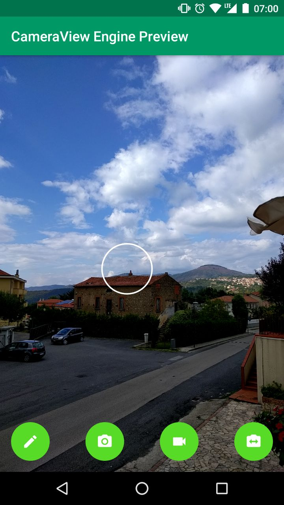

[](https://travis-ci.org/natario1/CameraView)
[](https://codecov.io/gh/natario1/CameraView)

<p align="center">
  
</p>

# CameraView

CameraView is a well documented, high-level library that makes capturing pictures and videos easy,
addressing most of the common issues and needs, and still leaving you with flexibility where needed.

```groovy
compile 'com.otaliastudios:cameraview:2.0.0-beta01'
```

- Fast & reliable
- Gestures support
- Frame processing support
- OpenGL powered preview
- Take high-quality content with `takePicture` and `takeVideo`
- Take super-fast snapshots with `takePictureSnapshot` and `takeVideoSnapshot`
- Smart sizing: create a `CameraView` of any size
- Control HDR, flash, zoom, white balance, exposure, location, grid drawing & more
- Lightweight: the only dep. is support `ExifInterface`
- Works down to API level 15
- Well tested

Read the [official website](https://natario1/github.io/CameraView) for setup instructions and documentation.

- Coming from v1? Take a look at the [migration guide](https://natario1/github.io/CameraView/extra/v1-migration-guide.html)
- Changelog is hosted [here](https://natario1/github.io/CameraView/about/changelog.html)

<p>
  
  
  
</p>